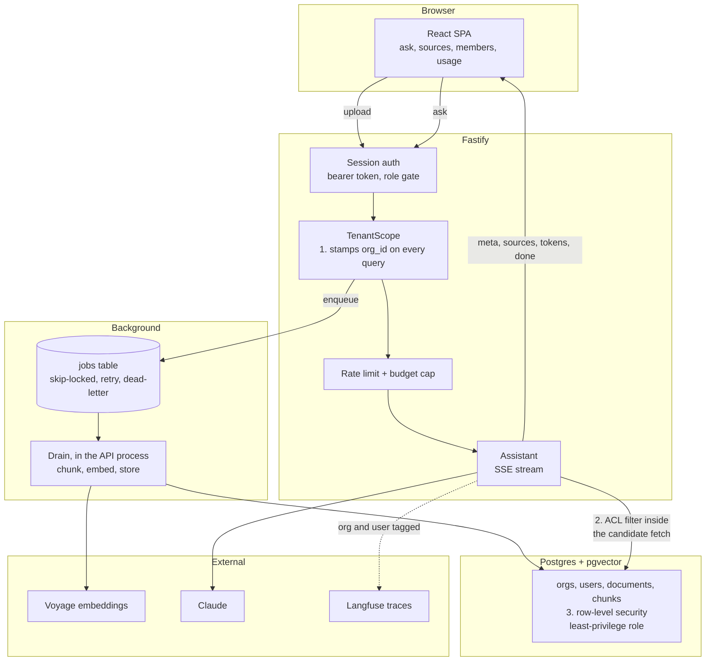

# Knowledge Desk (TypeScript)

A multi-tenant, permissions-aware knowledge assistant. Each organization connects
its documents, the system indexes them per tenant, and users ask questions and get
grounded, cited answers drawn only from the documents they are allowed to see.

This is a TypeScript port of [knowledge-desk](../knowledge-desk), which is a
Python project. Same schema, same API, same guarantees, same tests. It exists
because the original is the project I point at most often and a lot of the roles I
apply for are TypeScript, so pointing at a Python repo was answering a question
nobody asked.

The project is about the operational layer around an LLM application, not the
retrieval technique. The interesting parts are tenancy, access-controlled
retrieval, background ingestion, quotas and cost attribution, audit, and evals
that gate merges.

## What is worth reading here

If you already know the Python version, the port is not a translation exercise and
the interesting file is [LESSONS.md](LESSONS.md). Eleven things did not survive the
language change intact, and each one is written up with what broke and how it was
caught. The short version:

- A synchronous Fastify hook hangs **every** request through it, not only the ones
  it rejects. Twenty-two tests timing out at thirty seconds each, with nothing in
  the Postgres log because no query was ever issued.
- `for await ... of` calls `return()` on the generator when you `break`. Python's
  `for` does not. Two tests about billing an abandoned stream passed, and one of
  them passed for entirely the wrong reason.
- The mock embedder had to become a hand-written Mersenne Twister, because its
  contract is that the same text always yields the same vector and Node has no
  seedable RNG. It matches CPython to twelve decimal places, so a corpus embedded
  by the Python app is retrievable by this one against the same database.
- Every string index in the prompt-injection defence had to move to code points.
  An offset map built on JavaScript string indices drifts by one for every astral
  character before the span, which means a document with an emoji ahead of a
  forged marker gets silently mis-defused.

Three bugs in this repository were found by porting the tests rather than by
writing them: a 404 handler registered twice (so `SERVE_STATIC=1` never booted),
two `TenantScope` methods that threw synchronously from a `Promise`-typed
signature, and the migration runner resolving `../migrations` in a way that was
right for the sources and wrong for the build.

## Verified, not assumed

Every module whose behaviour had to match was checked against the Python
implementation on real inputs before anything was built on it:

| Module | Checked against Python on |
|---|---|
| `normalize.ts` | confusables, invisibles, an emoji before the span; identical folded text and identical origin maps |
| `embeddings.ts` | three inputs, identical vectors to 12 decimal places |
| `providers.ts` | forged markers in three dialects, fullwidth lookalikes, a zero-width space inside a word |
| `outputchecks.ts` | all seven finding codes, plus a wrapped quote and a curly-quoted one |

And the properties that matter were checked by breaking them on purpose:

| Removed | Caught by |
|---|---|
| the ACL predicate in the vector search | `permission-leak` eval, `y_leaked=true`, exit 1 |
| the `stop_reason: refusal` guard | `raises on a refusal instead of streaming nothing` |
| the embedding length check | document marked `ingested` while missing a chunk |
| the `finally` that bills an unfinished stream | both abandoned-stream tests |
| the headers on the raw SSE write | streamed answers ship with no CSP |
| the single 404 registration | `SERVE_STATIC=1` fails to boot, exit 1 |

## Status

Complete and verified locally. Not deployed — the Python version is the one that
is hosted, and running two of the same app costs money to prove a point already
made. The full stack does run in Docker (see below), and both permission
boundaries were checked through it end to end, including an upload drained by
the API container with no worker running.

- **252 tests**, 86/74/92/88 statements/branches/functions/lines
- **6 merge-gating evals**, all passing
- **1 real-model call**, run against `claude-sonnet-5`: it answered, quoted the
  passage, and cited `[1]`

## Architecture

Ingestion is asynchronous, so embedding never blocks a request. Asking is
synchronous and streams. The interesting property is that a question can only ever
reach documents the asker is allowed to see, and that is enforced three independent
times (marked below), so no single missed filter leaks data.



The three shields are the whole point: the data layer filters by `org_id`, the
retrieval query filters by the caller's ACL in the same SQL that ranks candidates
(so forbidden rows are never scored), and row-level security denies by default
underneath both. A bug in any one of them is not a data leak.

## Stack

Node 22, TypeScript under `strict` plus `noUncheckedIndexedAccess` and
`exactOptionalPropertyTypes`, Fastify, raw SQL over node-postgres, Postgres with
pgvector, a Postgres-backed job queue, Zod at the trust boundary, React
and Vite, Voyage embeddings, Claude for answers, Langfuse for observability,
Docker, and GitHub Actions. Runs keyless with a loud mock fallback, so it works and
tests green with no API keys.

Raw SQL rather than an ORM on purpose. The RLS tenant GUC, the `c.acl ?| principals`
predicate that keeps the HNSW index in play, and `for update skip locked` are the
project's actual argument, and an ORM hides all three.

## Run it locally

For development, run the database in Docker and the app on the host:

```bash
docker compose up -d db      # Postgres + pgvector on :5437
npm install
npm run migrate              # creates schema, RLS, and the app role
npm run seed                 # two demo orgs (optional; --reset rebuilds them)

npm run dev                  # API on :8000, drains the job queue itself

cd frontend && npm install && npm run dev   # UI on :5173
                                            # set VITE_API_BASE=http://localhost:8000
```

Port 5437, not 5436: the Python version holds that one and both should be runnable
at once.

Or run the whole stack (API + built UI + db) in containers:

```bash
docker compose up --build    # app on http://localhost:8000
```

### Demo logins

After `npm run seed` (password `demo-password-123`):

| org | email | in the restricted group |
|---|---|---|
| acme | owner@acme.test | yes, sees everything |
| acme | analyst@acme.test | no, sees less |
| globex | owner@globex.test | yes, sees everything |
| globex | operator@globex.test | no, sees less |

Ask "how long do refunds take?" as both owners: each org's documents are
non-overlapping, so a question in one can never retrieve the other's content. Then
ask "what are the engineering compensation bands?" as `owner@acme.test` and
`analyst@acme.test`. Same org, same question, different answers, because
`compensation.md` is restricted to a group only one of them is in. That second one
is the harder half of the boundary and the one tenant isolation alone cannot show.

## Tests and the eval gate

```bash
npm test          # 243 tests
npm run coverage  # the same, with the coverage floors CI enforces
npm run evals     # the 6 merge-gating evals
npm run typecheck
npm run lint
```

The evals assert system properties that hold whatever the model says: a permission
boundary held, a citation resolves, an injected instruction was quoted rather than
obeyed. That is what makes them trustworthy and also what they cannot tell you.
Nothing here measures whether the answers are any good.

They also cannot tell you whether a model answered **at all**. `claude-opus-5`
declines this system prompt outright, with `stop_reason: refusal` and category
`reasoning_extraction`, so every answer comes back empty while all six evals stay
green. That is why `answerModel` defaults to `claude-sonnet-5` and why there is one
test that calls a real model:

```bash
secrun npm run test:real    # one live call, a few hundred tokens, well under a cent
```

It runs on its own, under its own config. The default suite excludes it, because
several tests assert mock-provider behaviour and fail when a key is in the
environment — which is itself part of why a refusing model went unnoticed in the
first place.

## Observability

With `LANGFUSE_*` keys set, each question emits one Langfuse trace tagged by org
and user: a retriever span that records how many of the org's chunks the caller was
allowed to see (the ACL filter, made visible), and the answer as a generation with
token usage and cost. Without keys it is a no-op, and every tracer call is
exception-proof, so observability can never take the product down.

Note the variable name: the JavaScript SDK reads `LANGFUSE_BASE_URL` and ignores
`LANGFUSE_HOST`, which is what the Python SDK reads. Set the wrong one and traces
go to `cloud.langfuse.com` while you believe you are self-hosting.

Questions, answers, and document paths are PII-redacted on the way out, and the
user is tagged by id rather than email address. The same text is stored unredacted
in Postgres, which is deliberate: a question is content, and reading that table
already means being an admin of the asker's own org. Langfuse is a third party, so
neither half of that argument travels with it.

## What is not here

Two Python helper scripts and their tests did not come across: a markdown anchor
checker and a Dependabot config parser. Both exist to lint the original repository's
own docs and CI rather than to run the application, and porting them would have
meant porting two utilities to check things this repository does not have.

## License

MIT. See [LICENSE](LICENSE).
